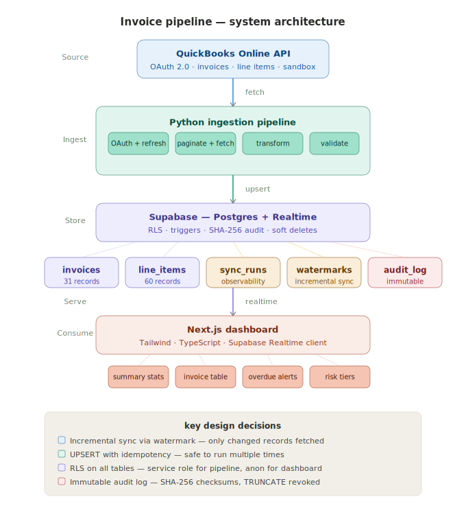

# Invoice Pipeline

A production-grade data pipeline that syncs invoice data from QuickBooks into Supabase and surfaces it on a live Next.js dashboard. Built as a consulting-ready solution for financial data monitoring.

---

## Architecture



---

## Project Structure

```
invoice-pipeline/
├── pipeline/
│   ├── __init__.py
│   ├── fetch.py          # QuickBooks OAuth + paginated fetch
│   ├── sync.py           # Transform + upsert + sync run tracking
│   └── validate.py       # Post-sync count reconciliation
├── dashboard/            # Next.js app (separate folder)
│   ├── app/
│   │   └── page.tsx      # Main dashboard page
│   └── lib/
│       └── supabase.ts   # Supabase client
├── docs/
│   └── architecture.svg  # System architecture diagram
├── schema.sql            # Complete production database schema
├── .env.example          # Environment variable template
├── .gitignore
└── README.md
```

---

## Quick Start

### Prerequisites

- Python 3.10+
- Node.js 18+
- QuickBooks Developer account (sandbox)
- Supabase project

### 1. Clone the repository

```bash
git clone https://github.com/WassayS/invoice-pipeline.git
cd invoice-pipeline
```

### 2. Set up Python environment

```bash
python -m venv venv
venv\Scripts\activate        # Windows
source venv/bin/activate     # macOS / Linux
pip install requests python-dotenv supabase
```

### 3. Configure environment variables

```bash
cp .env.example .env
```

Fill in your values in `.env`:

```
QB_CLIENT_ID=your_quickbooks_client_id
QB_CLIENT_SECRET=your_quickbooks_client_secret
QB_REALM_ID=your_quickbooks_realm_id
QB_ACCESS_TOKEN=your_quickbooks_access_token
QB_REFRESH_TOKEN=your_quickbooks_refresh_token
SUPABASE_URL=your_supabase_project_url
SUPABASE_SERVICE_KEY=your_supabase_service_role_key
ENVIRONMENT=development
```

### 4. Set up the database

Run `schema.sql` in your Supabase SQL editor. This creates all tables, indexes, triggers, RLS policies, and the audit log in a single transaction.

### 5. Run the pipeline

```bash
python pipeline/sync.py
```

### 6. Run the dashboard

```bash
cd dashboard
npm install
cp .env.local.example .env.local   # add your Supabase anon key
npm run dev
```

Open `http://localhost:3000`

---

## Pipeline Design Decisions

### Incremental sync via watermark

Every run fetches only invoices where `MetaData.LastUpdatedTime > last_synced_at`. The watermark is stored in the `sync_watermarks` table and only advances on a successful run. A failed run never moves the watermark forward — preventing data loss on retry.

**Why not full sync every run?** QuickBooks enforces a 500 requests/minute rate limit. Full sync on a large account with thousands of invoices would hit this ceiling and degrade pipeline performance significantly.

### UPSERT over DELETE + INSERT

Every write uses `INSERT ... ON CONFLICT DO UPDATE`. This guarantees idempotency — running the pipeline twice on the same data produces exactly the same result with no duplicates.

**Why not DELETE + INSERT?** Creates a window where the table is empty, breaks the audit trail, and is not atomic. A network failure mid-delete would leave the table in a corrupt state.

### Status derivation (Paid / Partial / Unpaid)

QuickBooks does not have an explicit status field. Status is derived from the `Balance` field:
- `Balance == 0` → Paid
- `0 < Balance < TotalAmt` → Partial
- `Balance == TotalAmt` → Unpaid

**Why three states?** A partially paid invoice is materially different from an unpaid one. Collapsing them into a single "Unpaid" state would mislead the finance team about actual cash position.

### `id` stored as `text` not `integer`

QuickBooks returns IDs as strings in their API response. Storing as `integer` would silently break if QuickBooks ever uses alphanumeric IDs — a change outside our control.

### Service role key for pipeline, anon key for dashboard

Supabase has two key types. The service role key bypasses Row Level Security and is used exclusively by the backend pipeline. The anon key is subject to RLS policies and is the only key exposed to the frontend. The service role key never appears in any frontend code.

### Soft deletes only

Financial records are never hard deleted. When an invoice is deleted in QuickBooks, `deleted_at` is set. The record remains in the database indefinitely for audit and compliance purposes. The dashboard filters `WHERE deleted_at IS NULL`.

### Audit log immutability

The `audit_log` table has a database trigger that raises an exception on any `UPDATE` or `DELETE` attempt. `TRUNCATE` is revoked from all non-superuser roles. Every write is captured with a SHA-256 checksum using sorted key=value pairs for stability across Postgres versions.

---

## Database Schema

Six tables with full production constraints:

| Table | Purpose |
|---|---|
| `invoices` | Core invoice records from QuickBooks |
| `invoice_line_items` | Individual line items per invoice |
| `sync_runs` | One row per pipeline execution — observability |
| `sync_watermarks` | Incremental sync state per entity |
| `audit_log` | Immutable change log with SHA-256 checksums |
| `failed_records` | Dead letter queue for failed records |

Key constraints:
- `CHECK (balance <= amount)` — financial integrity
- `CHECK (due_date >= issue_date)` — logical consistency
- `CHECK (status IN ('Paid','Unpaid','Partial','Voided'))` — enum enforcement
- `CHECK (detail_type != 'SubTotalLineDetail')` — prevents subtotal rows in line items
- `created_at` is immutable after insert (trigger-enforced)
- `synced_at` auto-updates on every upsert (trigger-enforced)

---

## Observability

Every pipeline run is recorded in `sync_runs`:

```sql
SELECT run_id, status, records_fetched, records_upserted,
       duration_ms, watermark_from, watermark_to
FROM sync_runs
ORDER BY started_at DESC
LIMIT 10;
```

This answers:
- When did the pipeline last run?
- How long did it take?
- How many records were processed?
- Did it succeed or fail?
- What time window did it cover?

---

## Validation

After every sync, the pipeline automatically compares QuickBooks total invoice count against Supabase:

```
QuickBooks count : 31
Supabase count   : 31
Validation PASSED — counts match
```

A mismatch triggers a failure log and blocks the watermark from advancing.

---

## Security

- All credentials stored in `.env` — never in code or git history
- `.env` listed in `.gitignore` — cannot be accidentally committed
- Service role key used only in backend pipeline
- Anon key used only in frontend dashboard
- RLS enabled on all six tables
- Anonymous access explicitly blocked on all tables
- Audit log is immutable at database level
- SHA-256 checksums on all audit entries

---

## Known Limitations and Future Work

**Webhook-based sync (planned v2)**
The current implementation polls on a schedule. In production, QuickBooks webhooks would push change notifications in real time, reducing latency to near-zero and eliminating wasted API calls when nothing has changed.

**Full test suite**
Unit tests cover transformation logic. Integration tests against the sandbox and contract tests against the QuickBooks API schema are planned.

**Environment separation**
The pipeline is structured for dev/staging/production separation via the `ENVIRONMENT` variable. Separate Supabase projects per environment are recommended before production client deployment.

**Token rotation automation**
Refresh tokens expire after 101 days. Currently requires manual regeneration. Automatic rotation with persistence to a secrets manager is planned.

**Natural language querying**
A planned AI layer will allow the finance team to query invoices in plain English — converted to SQL via an LLM call against the Supabase database.

---

## Tech Stack

| Layer | Technology |
|---|---|
| Data source | QuickBooks Online API |
| Pipeline | Python 3, requests, supabase-py |
| Database | Supabase (Postgres 15) |
| Dashboard | Next.js 14, TypeScript, Tailwind CSS |
| Auth | Supabase RLS + OAuth 2.0 |
| Deployment | Vercel (dashboard), local cron (pipeline) |
